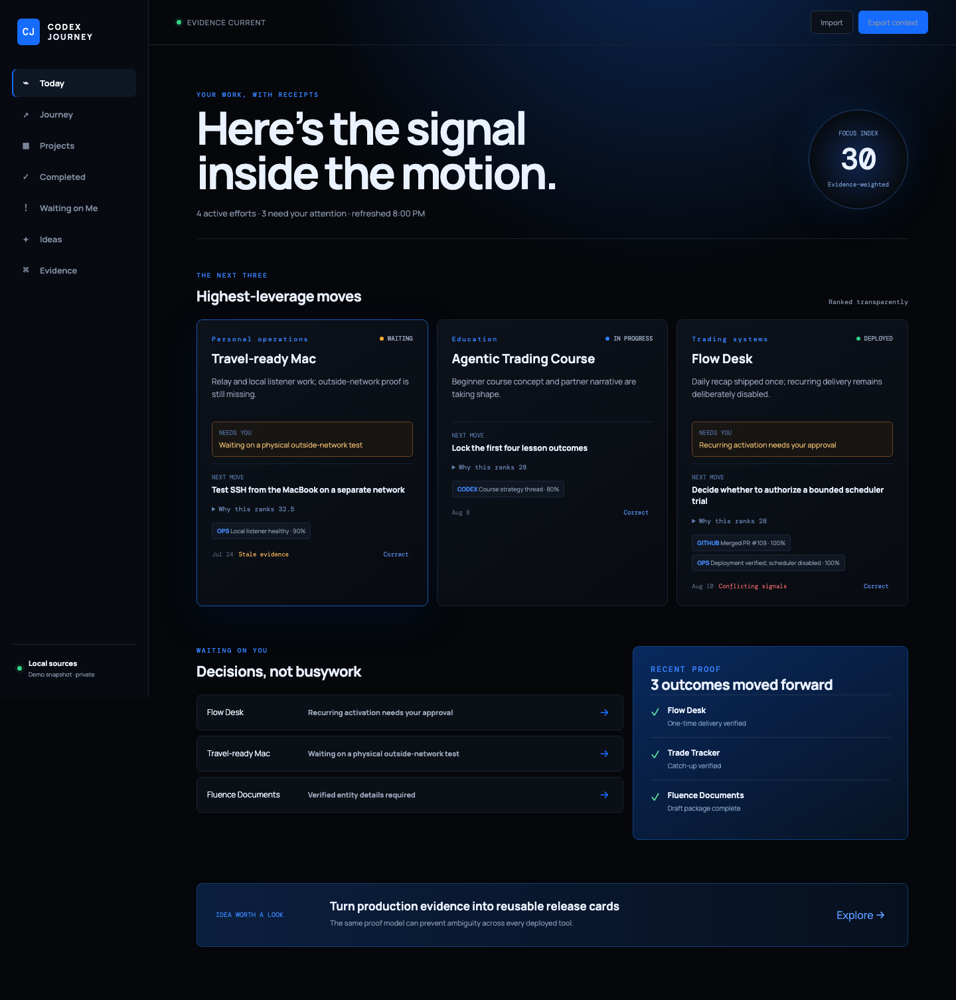

# Codex Journey

A private, evidence-backed reflection and prioritization dashboard for Codex work. In ten seconds it answers what is moving, what actually finished, what needs you, and which three projects deserve attention next.



## Run the polished demo

Requires Node 22+.

```bash
npm install
npm run dev
```

Open `http://127.0.0.1:5173`. The demo uses deterministic fictional fixtures spanning trading systems, business documents, Mac operations, and course work. Try Today, Journey, Waiting on Me, Ideas, Evidence, project corrections, and Markdown export.

## Safe local onboarding

Generate an ignored, redacted snapshot without mutating Codex, Git, or GitHub:

```bash
npm run scan -- --repo-root "/path/to/development"
```

This reads Codex metadata through SQLite immutable mode, reads bounded local Git history, and atomically writes `public/local-snapshot.json`. Import the snapshot through the dashboard. Add Codex Ops JSONL streams with repeated `--event /path/to/audit.jsonl`. Full prompts, diffs, credentials, and secret-bearing environment data are neither collected nor displayed.

User status corrections persist in browser local storage and take precedence over inference. Recommendations are advisory; Journey never archives, deploys, schedules, messages, creates issues, or activates production.

## Product and engineering notes

- [Product brief](docs/product-brief.md)
- [Architecture and migrations](docs/architecture.md)
- [Prioritization model](docs/prioritization.md)
- [Privacy and security](docs/privacy-security.md)
- [Codex Ops event contract](docs/event-contract.md)
- [Verification](docs/verification.md)

## Real-data readiness

Before treating the dashboard as an operational source, review project grouping from the first scan, connect explicit Production Truth Board exports, and add an authenticated local-only adapter if live GitHub API evidence is desired. The current scanner deliberately infers only `started` from Codex threads; completion requires stronger imported evidence.
